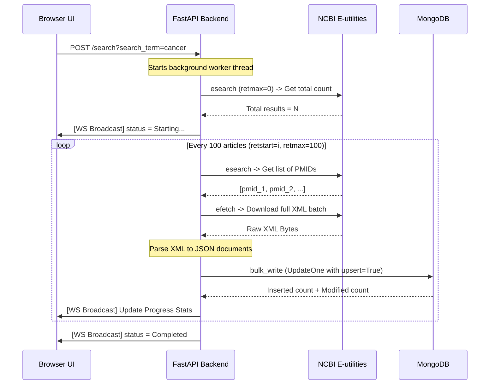

# Technical Overview: NCBI PubMed Ingestion Platform

This document describes the design, ingestion pipeline, and technical choices of the **PubMed Ingestion Platform**.

---

## 1. System Architecture

The platform uses a modular, decoupled Python architecture powered by **FastAPI** (asynchronous backend) and **MongoDB** (data storage).

```
   ┌──────────────────────────────────────────────────────────┐
   │                  HTML5 / JavaScript UI                  │
   └─────────────▲─────────────────────────────▲──────────────┘
                 │                             │
        HTTPS (JSON APIs)             WebSockets (Live Stats)
                 │                             │
   ┌─────────────▼─────────────────────────────▼──────────────┐
   │                      FastAPI Web App                     │
   │               (lifespan connects to MongoDB)             │
   └─────────────┬─────────────────────────────┬──────────────┘
                 │                             │
        Ingestion Thread               Database Queries
                 │                             │
   ┌─────────────▼────────────┐        ┌───────▼──────────────┐
   │     E-Utilities API      │        │       MongoDB        │
   │   (esearch, efetch XML)  │        │ (Deduplicated index) │
   └──────────────────────────┘        └──────────────────────┘
```

### Module Breakdown
1. **`main.py`**: Entrypoint. Registers FastAPI routes, WebSocket handlers, and mounts standard lifecycle events.
2. **`config.py`**: Central config repository. Validates environment variables (`.env`) and initializes logging configurations.
3. **`database.py`**: Exposes the asynchronous MongoDB collection and indexes. Ensures a `unique` constraint index on `pmid` for rapid lookup/upserts.
4. **`ncbi_client.py`**: A client layer querying the NCBI E-utilities REST endpoints. Built with `tenacity` retry logic to survive API rate-limiting or network issues.
5. **`xml_parser.py`**: Lxml-based utility to parse complex XML trees. Maps nodes (authors, titles, abstracts, MeSH terms, and DOI metadata) to standardized JSON documents.
6. **`state.py`**: Thread-safe global progress tracker with a WebSocket connections broadcast pool.
7. **`ingestion.py`**: Orchestrates background tasks, scheduling batched HTTP client routines, and writing results to the DB.

---

## 2. Ingestion & Batching Workflow

Since query searches on terms like `"cancer"` can yield hundreds of thousands of articles, fetching all records at once is not feasible. The ingestion pipeline works in **batches of 100** (default):



### Ingestion Logic:
1. **Deduplication**: We write to MongoDB using an `UpdateOne` bulk operation:
   - `$setOnInsert`: Writes `created_at` only when the document is first added.
   - `$set`: Overwrites the actual fields (updates title, abstract, authors, etc.) and updates `updated_at`.
   - `upsert=True`: If the `pmid` already exists, it is refreshed in-place instead of creating a duplicate document.
2. **Rate Limiting**: To comply with NCBI usage policies, the worker yields execution:
   - `0.11 seconds` delay between requests if using a valid `NCBI_API_KEY`.
   - `0.34 seconds` delay between requests otherwise.

---

## 3. UI Real-time Updates

1. **State Preservation**: The backend maintains a thread-locked progress dict. When a client initiates a WebSocket connection at `/ws/progress`, the backend immediately streams the current snapshot.
2. **Session-based Display**: If a search completes, the progress stats remain visible to the user. When the page is reloaded or refreshed, the frontend resets session states; if no ingestion is currently active, the progress card hides automatically to keep a clean interface.
